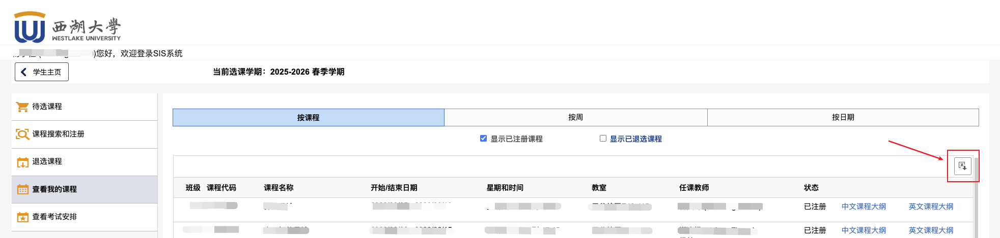

# westlake-ics

将西湖大学教务系统（SIS）的课程表自动转换为主流日历格式。

| 脚本 | 输出 | 适用 |
|------|------|------|
| `ps2ics.py` | `.ics` | Apple 日历、Google 日历、Outlook |
| `ps2wakeup.py` | `.csv` | WakeUp 课程表 App |

**无需安装任何第三方库，Python 3.6+ 即可运行。**

如果这个项目对你有帮助，欢迎点一下右上角的 ⭐ Star，让更多同学看到～

---

## 使用方法

### 第一步：下载本项目

**方式一：直接下载 ZIP（推荐不熟悉 Git 的同学）**

点击页面右上角绿色的 **Code** 按钮 → **Download ZIP**，解压到桌面备用。

**方式二：git clone**

```bash
git clone https://github.com/wzsyyh/westlake-ics.git
cd westlake-ics
```

---

### 第二步：从 SIS 下载课程表

1. 打开 [SIS 选课系统](https://sis.westlake.edu.cn/psc/CSPRD_3/EMPLOYEE/SA/c/SSR_STUDENT_FL.SSR_MD_SP_FL.GBL?Action=U&MD=Y&GMenu=SSR_STUDENT_FL&GComp=SSR_START_PAGE_FL&GPage=SSR_START_PAGE_FL&scname=CS_SSR_MANAGE_CLASSES_NAV)（需登录校园账号）
2. 左侧菜单点击 **查看我的课表**
3. 选择顶部 **按课程** 标签页
4. 点击页面**右上角的下载按钮**（见下图红框）



5. 保存文件，默认文件名为 `ps.xls`，将其放入本项目文件夹

---

### 第三步：运行脚本

打开终端，进入项目文件夹后运行：

**生成 `.ics`（Apple 日历 / Google 日历 / Outlook）：**

```bash
python3 ps2ics.py ps.xls
```

**生成 `.csv`（WakeUp 课程表 App）：**

```bash
python3 ps2wakeup.py ps.xls
```

也可用 `-o` 指定输出路径：

```bash
python3 ps2ics.py ps.xls -o ~/Desktop/schedule.ics
```

---

### 第四步：导入日历

#### Apple 日历

双击 `schedule.ics`，弹出导入确认窗口后点击「导入」。

#### Google 日历

1. 打开 [Google 日历](https://calendar.google.com) 网页端
2. 右上角齿轮 → **设置** → 左侧**导入和导出** → **导入**
3. 选择 `schedule.ics`，点击「导入」

#### Outlook

双击 `schedule.ics` 即可，或手动操作：**文件 → 打开和导出 → 导入/导出 → 导入 iCalendar (.ics)**

#### WakeUp 课程表 App

WakeUp 的导入格式不含节次时间信息，需要**提前配置一次**西湖大学的节次时间（之后每学期导入无需重复设置）。

**① 配置节次时间（只需一次）**

进入 WakeUp **课表设置 → 节次时间**，将节数设为 13，按下表填写：

| 节次 | 上课 | 下课 | 节次 | 上课 | 下课 |
|------|------|------|------|------|------|
| 第 1 节 | 08:00 | 08:45 | 第 8 节 | 15:10 | 15:55 |
| 第 2 节 | 08:50 | 09:35 | 第 9 节 | 16:10 | 16:55 |
| 第 3 节 | 09:50 | 10:35 | 第 10 节 | 17:00 | 17:45 |
| 第 4 节 | 10:40 | 11:25 | 第 11 节 | 18:30 | 19:15 |
| 第 5 节 | 11:30 | 12:15 | 第 12 节 | 19:20 | 20:05 |
| 第 6 节 | 13:30 | 14:15 | 第 13 节 | 20:10 | 20:55 |
| 第 7 节 | 14:20 | 15:05 | | | |

**② 导入课程**

WakeUp 主界面右上角 → **导入课表** → **从 CSV 文件** → 选中 `wakeup.csv`

---

## 注意事项

- **数据结构与算法设计（EST2005）** 在原始数据中有两条重复的周五记录（教室分别为 H6-303 和 H6-305），导入后可手动删除其中一条
- 时间均以**北京时间**（Asia/Shanghai）写入，跨平台导入不会出现时差问题
- 如有课程时间有误，请确认 SIS 下载的 `ps.xls` 是否为当前学期数据
